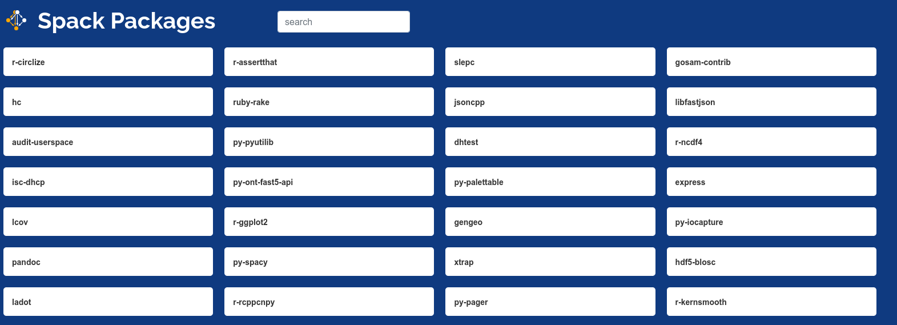
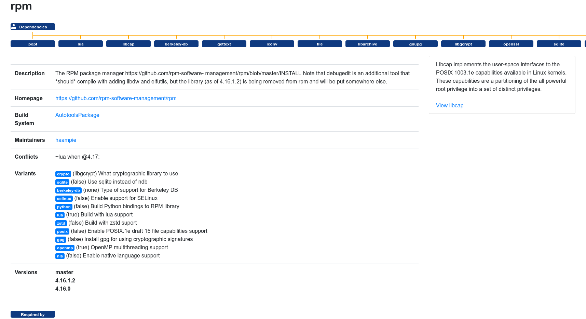

# Spack Packages

> What packages can I install with spack?

While spack does have a [page for a list of packages](https://spack.readthedocs.io/en/latest/package_list.html) 
it's a bit limited in metadata and hard to navigate. How about we instead create a richer search interface,
and one that updates itself nightly? This is the spack packages repository!




⭐️ [See the Packages!](https://spack.github.io/packages/) ⭐️

## Usage

You should run the generate script with spack, which means that it needs to be
on your path.

```bash
$ spack python generate_packages.py
```

This will generate a structure of data in [data](data) that is used to
generate the site.

```bash
$ tree data/
data/
├── packages
│   ├── 3dtk.json
│   ├── 3proxy.json
│   ├── abduco.json
│   ├── abi-compliance-checker.json
│   ├── abi-dumper.json
│   ├── abinit.json
│   ├── abseil-cpp.json
│   ├── abyss.json
│   ├── accfft.json
...
│   ├── zfs.json
│   ├── zig.json
│   ├── zip.json
│   ├── zipkin.json
│   ├── zlib.json
│   ├── zlib-ng.json
│   ├── zoltan.json
│   ├── zookeeper-benchmark.json
│   ├── zookeeper.json
│   ├── zsh.json
│   ├── zstd.json
│   ├── zstr.json
│   └── zziplib.json
└── packages.json

1 directory, 5668 files
```

You can then start a local web server to look at the interface!

```bash
$ python -m http.server 9999
```

The above would open to [http://localhost:9999](http://localhost:9999).
You can then browse the packages!



## Find an Issue?

There are a lot of edge cases with respect to metadata, so if you find a bug
please [let us know!](https://github.com/spack/packages). We will get it 
fixed up promptly.
